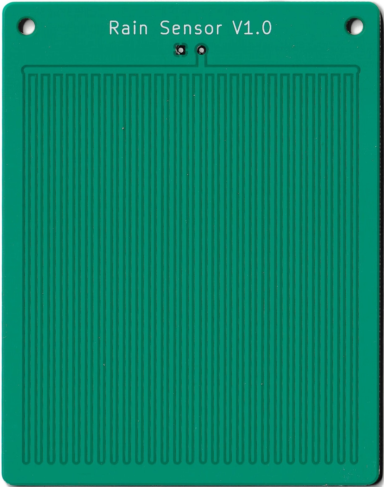
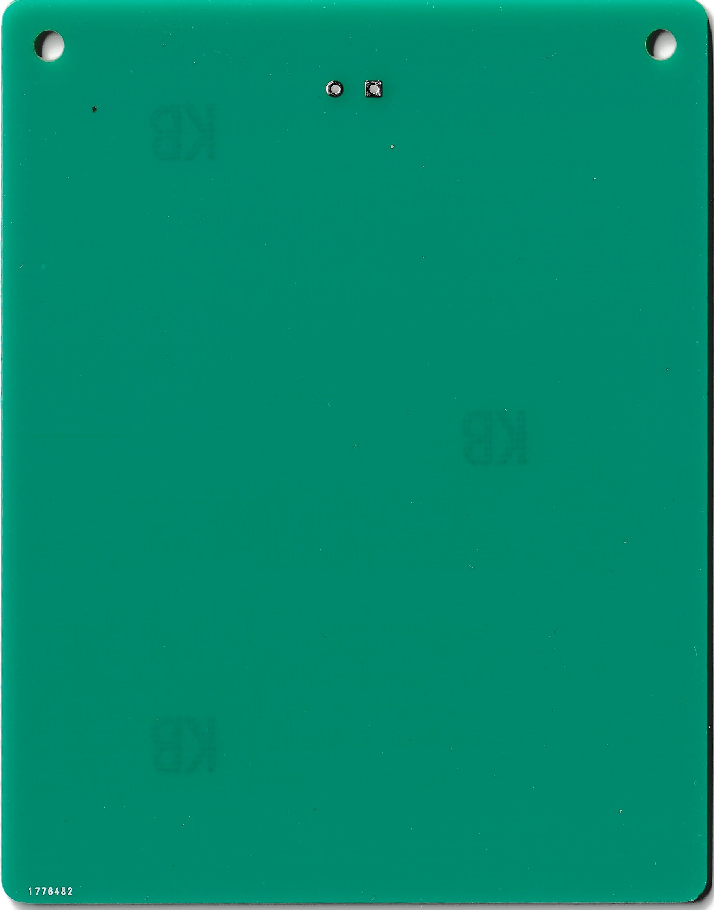
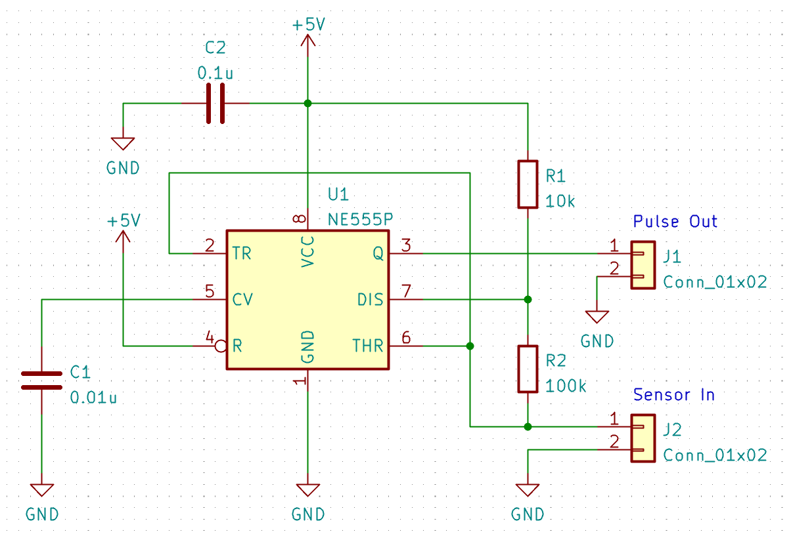

# 静電容量式レインセンサ

## 更新履歴

これは最新版のドキュメントです。以前のバージョンは以下から閲覧できます。  
<table>
  <thead>
    <tr>
      <th>作成日</th>
      <th>内容</th>
      <th>URL</th>
    </tr>
  </thead>
  <tbody>
    <tr>
        <td>2022/06/21</td>
        <td>初版</td>
        <td><a href="https://naoto64.github.io/Capacitive-Rain-Sensor/index_old_20230223">2023/02/23 以前のバージョン</a></td>
    </tr>
    <tr>
        <td>2023/02/23</td>
        <td>レジスト色変更</td>
        <td><a href="https://naoto64.github.io/Capacitive-Rain-Sensor/">この文書（最新版）</a></td>
    </tr>
  </tbody>
</table>

## 概要

このセンサは静電容量式のレインセンサです。  

雨粒が基板の上に落ちると、端子間の静電容量が変化します。その静電容量を読み取ることで、雨を検知することができます。
このセンサは従来の抵抗式とは違い、電極が腐食しないため、長時間の屋外使用でも耐久性が上がります。
また、基板のはんだ付け後に追加で適切な防水加工を施すと、センサを絶縁することが可能になります。

## 購入

この製品は以下のサイトから購入できます。  
[スイッチサイエンス - 静電容量式レインセンサ基板](https://www.switch-science.com/catalog/8202/)

#### 取扱説明書

<table>
  <thead>
    <tr>
      <th>バージョン</th>
      <th>URL</th>
    </tr>
  </thead>
  <tbody>
    <tr>
        <td>最新版</td>
        <td><a href="https://naoto64.github.io/Capacitive-Rain-Sensor/manual_8202_20230223.pdf" download>manual_8202_20230223.pdf</a></td>
    </tr>
    <tr>
        <td>2023/02/23以前</td>
        <td><a href="https://naoto64.github.io/Capacitive-Rain-Sensor/manual_8202_20220621.pdf" download>manual_8202_20220621.pdf</a></td>
    </tr>
  </tbody>
</table>

## 製品画像




## 静電容量検出回路

センサの静電容量値を測定するための検出回路は以下になります。センサーをSensor Inに接続し、Pulse Outをマイコンなどの入力に接続します。LOWパルスの長さを測定することで、現在の静電容量値を読み取ることができます。


## 静電容量パルス測定用プログラム

Arduino UNO 用のサンプルスケッチです。
2番ピンにパルス出力を接続します。雨を検出すると13番のLEDが光ります。
```RAIN_THR```の値がしきい値になっています。この値を変更することで、感度を調節できます。範囲は```0~255```で、```0```に近づけるほど感度が良くなり、```255```に近づけるほど感度が悪くなります。このプログラムは雨が落ちたかどうかを検出します。雨が降るとセンサが反応しますが、雨粒が落ちないと反応しないようになっています。雨粒が落ちると再度反応します。

```c
#define RAIN_IN_PIN 2
#define RAIN_OUT_PIN 13

#define TIMEOUT_US 100000
#define R_K_OHM 100.0
#define SAMPLES 100

#define LOWPASS_CAP 0.995
#define LOWPASS_RAIN 0.9
#define LOWPASS_MAX 1.0
#define CAP_AMP 0.2
#define CAP_MAX 255.0
#define RAIN_AMP 100.0
#define RAIN_MAX 255.0
#define RAIN_THR 20.0

float rain;
float cap;
float cap_before;

void setup(){
  rain = 0;
  cap = 0;
  cap_before = 0;
  pinMode(RAIN_OUT_PIN, OUTPUT);
}

float get_cap(){
  return (float)pulseIn(RAIN_IN_PIN, LOW, TIMEOUT_US) * (1000.0 / R_K_OHM) / log(2);
}

void loop(){
  cap_before = cap;
  cap = 0;
  for(int i = 0; i < SAMPLES; i++){
    cap += get_cap();
    delayMicroseconds(100);
  }
  cap = constrain(cap_before * LOWPASS_CAP + cap * CAP_AMP * (LOWPASS_MAX - LOWPASS_CAP) / SAMPLES, 0, CAP_MAX);
  rain = constrain(rain * LOWPASS_RAIN + max(cap - cap_before, 0) * RAIN_AMP * (LOWPASS_MAX - LOWPASS_RAIN), 0, RAIN_MAX);
  if(rain > RAIN_THR){
    digitalWrite(RAIN_OUT_PIN, HIGH);
  }
  else{
    digitalWrite(RAIN_OUT_PIN, LOW);
  }
}
```
